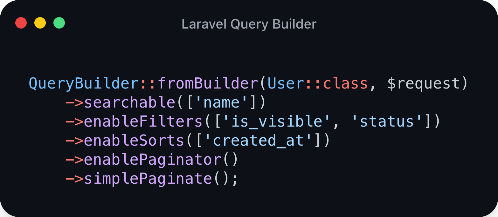

# Laravel Query Builder



[](https://github.com/zingimmick/laravel-query-builder/actions/workflows/tests.yml)
[](https://codecov.io/gh/zingimmick/laravel-query-builder)
[](https://packagist.org/packages/zing/laravel-query-builder)
[](https://packagist.org/packages/zing/laravel-query-builder)
[](https://packagist.org/packages/zing/laravel-query-builder)
[](https://packagist.org/packages/zing/laravel-query-builder)
[](https://scrutinizer-ci.com/g/zingimmick/laravel-query-builder)
[](https://github.styleci.io/repos/255621279)
[](https://codeclimate.com/github/zingimmick/laravel-query-builder/maintainability)
[](https://app.fossa.com/projects/git%2Bgithub.com%2Fzingimmick%2Flaravel-query-builder?ref=badge_shield)

### Requirements

- [PHP 8.0+](https://php.net/releases/)
- [Composer](https://getcomposer.org)
- [Laravel 8.0+](https://laravel.com/docs/releases)

Require Laravel Query Builder using [Composer](https://getcomposer.org):

```bash
composer require zing/laravel-query-builder
```

- [Basic usage](#basic-usage)
- [Search](#search)
  - [Composite search](#composite-search)
- [Filter](#filter)
  - [Typed filter](#typed-filter)
  - [Flagged filter](#flagged-filter)
  - [Cast Input(Skip auto cast)](#cast-inputskip-auto-cast)
- [Sort](#sort)
- [Paginator](#paginator)


## Usage

### Basic usage

```php
use Zing\QueryBuilder\QueryBuilder;
use Zing\QueryBuilder\Tests\Models\User;

// uri: /api/users?search=Harry&status=1,2,3&desc=created_at&per_page=10
// sql: select * from "users" where ("name" like "%Harry%") and "status" in ("1", "2", "3") order by "created_at" desc limit 11 offset 0
QueryBuilder::fromBuilder(User::class, $request)
    ->searchable(['name'])
    ->enableFilters(['is_visible', 'status'])
    ->enableSorts(['created_at'])
    ->enablePaginator()
    ->simplePaginate();
```

### Search

```php
use Zing\QueryBuilder\QueryBuilder;
use Zing\QueryBuilder\Tests\Models\User;

// uri: /api/users?search=Harry
// sql: select * from "users" where ("name" like "%Harry%" or "email" like "%Harry%") limit 16 offset 0
QueryBuilder::fromBuilder(User::class, $request)
    ->searchable(['name', 'email'])
    ->simplePaginate();
```

#### Composite search

**⚠️ The filter with default value is not supported yet.**

```php
use Zing\QueryBuilder\Filter;
use Zing\QueryBuilder\QueryBuilder;
use Zing\QueryBuilder\Tests\Models\User;

// uri: /api/users?search=2021
// sql: select * from "users" where ("number" like "%2021%" or ("id" = "2021")) limit 16 offset 0
QueryBuilder::fromBuilder(User::class, $request)
    ->searchable(['number', Filter::exact('encoded_id', 'id')])
    ->simplePaginate();
```

### Filter

```php
use Zing\QueryBuilder\Filter;
use Zing\QueryBuilder\QueryBuilder;
use Zing\QueryBuilder\Tests\Models\User;

// uri: /api/users?name=Harry
// sql: select * from "users" where "name" like "%Harry%" limit 16 offset 0
QueryBuilder::fromBuilder(User::class, $request)
    ->enableFilters([Filter::partial('name')])
    ->simplePaginate();
```

```php
use Zing\QueryBuilder\Filter;
use Zing\QueryBuilder\QueryBuilder;
use Zing\QueryBuilder\Tests\Models\User;

// uri: /api/users?status=1,2,3
// sql: select * from "users" where "status" in ("1", "2", "3") limit 16 offset 0
QueryBuilder::fromBuilder(User::class, $request)
    ->enableFilters([Filter::exact('status')])
    ->simplePaginate();
```

```php
use Zing\QueryBuilder\Filter;
use Zing\QueryBuilder\QueryBuilder;
use Zing\QueryBuilder\Tests\Models\User;

// uri: /api/users?visible=1
// sql: select * from "users" where "is_visible" = true limit 16 offset 0
// uri: /api/users
// sql: select * from "users" where "is_visible" = true limit 16 offset 0
QueryBuilder::fromBuilder(User::class, $request)
    ->enableFilters([Filter::scope('visible')->default(true)])
    ->simplePaginate();
```

#### Typed filter

**⚠️ The filter with default value is not supported yet.**

```php
use Zing\QueryBuilder\Filter;
use Zing\QueryBuilder\QueryBuilder;
use Zing\QueryBuilder\Tests\Models\Order;

// uri: /api/users?search_type=number&search_value=2021
// sql: select * from "orders" where "number" like "%2021%" limit 16 offset 0
QueryBuilder::fromBuilder(Order::class, $request)
    ->enableTypedFilter(
        'search_type',
        'search_value',
        [Filter::partial('number'), Filter::partial('user_name', 'user.name')]
    )
    ->simplePaginate();
```

#### Flagged filter

```php
use Zing\QueryBuilder\Filter;
use Zing\QueryBuilder\QueryBuilder;
use Zing\QueryBuilder\Tests\Models\Order;

// uri: /api/users?number=2021&user_name=Jone
// sql: select * from "orders" where (("number" like "%2021%") or (exists (select * from "users" where "orders"."user_id" = "users"."id" and "users"."name" like "%Jone%"))) limit 16 offset 0
QueryBuilder::fromBuilder(Order::class, $request)
    ->enableFlaggedFilter([Filter::partial('number'), Filter::partial('user_name', 'user.name')])
    ->simplePaginate();
```

#### Cast Input(Skip auto cast)

```php
use Zing\QueryBuilder\Enums\CastType;
use Zing\QueryBuilder\Filter;
use Zing\QueryBuilder\QueryBuilder;
use Zing\QueryBuilder\Tests\Models\User;

// uri: /api/users?is_visible=true
// sql: select * from "users" where "is_visible" = true limit 16 offset 0
// uri: /api/users?is_visible=true,false
// sql: select * from "users" where "is_visible" in (true, false) limit 16 offset 0
QueryBuilder::fromBuilder(User::class, $request)
    ->enableFilters(Filter::exact('is_visible')->withCast(CastType::BOOLEAN))
    ->simplePaginate();
```

```php
use Zing\QueryBuilder\Enums\CastType;
use Zing\QueryBuilder\Filter;
use Zing\QueryBuilder\QueryBuilder;
use Zing\QueryBuilder\Tests\Models\Order;

// uri: /api/orders?content=code,and
// sql: select * from "orders" where "content" like "%code,and%" limit 16 offset 0
QueryBuilder::fromBuilder(Order::class, $request)
    ->enableFilters(Filter::partial('content')->withCast(CastType::ORIGINAL))
    ->simplePaginate();
```

### Sort

```php
use Zing\QueryBuilder\QueryBuilder;
use Zing\QueryBuilder\Sort;
use Zing\QueryBuilder\Tests\Models\Order;

// uri: /api/users?desc=created_date
// sql: select * from "orders" order by "created_at" desc limit 16 offset 0
QueryBuilder::fromBuilder(Order::class, $request)
    ->enableSorts([Sort::field('created_date', 'created_at')])
    ->simplePaginate();
```

### Paginator

```php
use Zing\QueryBuilder\QueryBuilder;
use Zing\QueryBuilder\Tests\Models\User;

// uri: /api/users?size=5
// sql: select * from "users" limit 6 offset 0
QueryBuilder::fromBuilder(User::class, $request)
    ->enablePaginator('size')
    ->simplePaginate();
```

```php
use Zing\QueryBuilder\Paginator;
use Zing\QueryBuilder\QueryBuilder;
use Zing\QueryBuilder\Tests\Models\User;

// uri: /api/users?size=
// sql: select * from "users" limit 6 offset 0
QueryBuilder::fromBuilder(User::class, $request)
    ->enablePaginator(Paginator::name('size')->default(5))
    ->simplePaginate();
```

## License

Laravel Query Builder is an open-sourced software licensed under the [MIT license](LICENSE).

[](https://app.fossa.com/projects/git%2Bgithub.com%2Fzingimmick%2Flaravel-query-builder?ref=badge_large)
